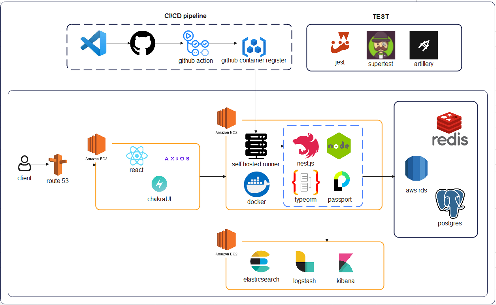
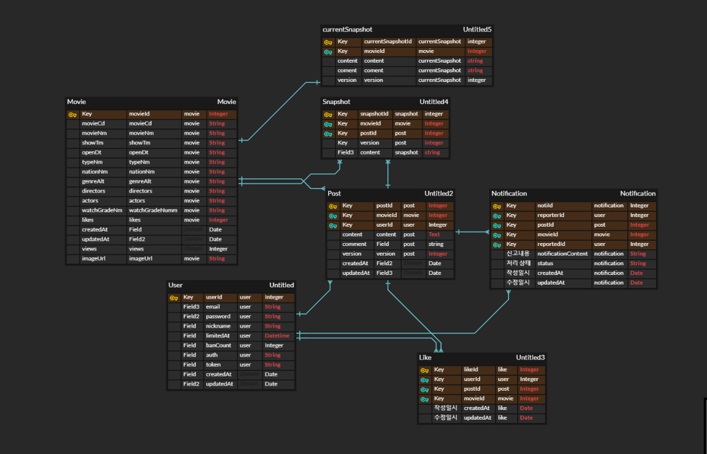

# 🎬 MovieWiki

## 👋 서비스 소개

MovieWiki는 Movie + Wikipedia의 합성어로 영화와 관련된 모든 정보를 문서화하여 공동 편집하고,
문서의 버저닝과 롤백을 지원하는 영화 전문 위키피디아 서비스 입니다.

## 🧑‍💻 팀원 소개

- **Back End**
  - 신원익([https://github.com/namu56](https://github.com/namu56))
  - 오성인(팀장)([https://github.com/dhtjddls](https://github.com/dhtjddls))
  - 이동환([https://github.com/meadd231](https://github.com/meadd231))
  - 홍준상([https://github.com/redjun89](https://github.com/redjun89))

## 📝 Project Architecture

## 🛠 Tech Stack

- Nest.JS
- Typescript
- PostgreSQL
- Redis
- Elasticsearch
- Githubaction
- Docker
- EC2
- ALB
- Route53
- Artillery
- Jest
- Supertest

## 📋 ERD

